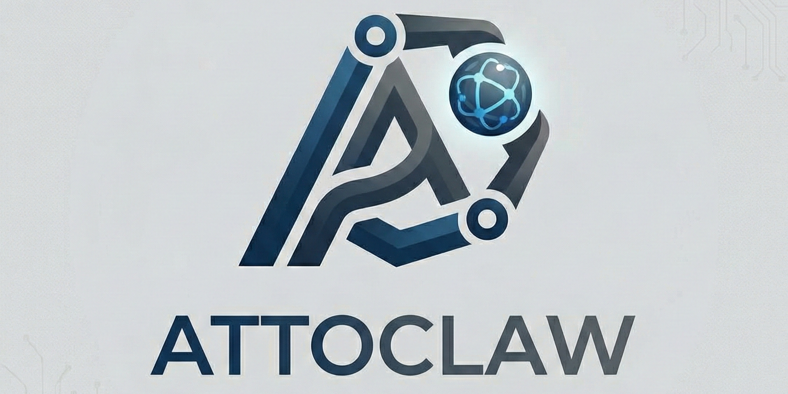

# [AttoClaw](https://attoclaw.github.io/)

<p align="center">

</p>

AttoClaw is a high-performance C++ port of openclaw focused on low overhead, deterministic runtime behavior, and practical local automation.

This repo currently builds a single binary:

- `attoclaw.exe` (Windows)
- `attoclaw` (Linux/macOS)

## Why AttoClaw

AttoClaw is built for minimal runtime overhead: fast startup, low memory usage, and a very small binary for constrained systems.

### Measured local stats (current build: `attoclaw v0.1.0`)

| Metric | Result |
|---|---|
| Binary size (`attoclaw.exe`) | `768,512 bytes` (`750.5 KB`, `0.733 MB`) |
| Startup time (`--version`, avg of 10 runs) | `37.89 ms` |
| Startup time (`status`, avg of 5 runs) | `44.88 ms` |
| Single-turn agent time (mock local LLM, avg of 5 runs) | `64.57 ms` |
| Peak RAM (`status`, avg) | `1.46 MB` |
| Peak RAM (`single-turn agent`, avg) | `4.44 MB` |

*These are initial, non-final benchmarking numbers and do not represent a stable cross-system comparison.*

## Current scope

Implemented and stable:

- Core CLI: `onboard`, `status`, `doctor`, `agent`, `gateway`, `channels`, `cron`
- Operator helpers: `send`, `metrics`
- Agent loop with tool calling
- Session persistence and memory files
- Channels: Telegram, WhatsApp (bridge), Slack, Discord
- Email channel (outbound SMTP)
- Voice notes: channel audio download + automatic transcription into prompt context
- Providers: OpenAI-compatible (OpenAI/OpenRouter/NVIDIA NIM compatible)
- Streaming output in CLI (`attoclaw agent --stream`) with tool-call safe buffering
- Voice transcription tool + CLI (`transcribe`)
- Vision tools and OCR support (vision blocked on headless servers)
- Runtime `/stop` cancellation
- Performance benchmark script
- Docker workflow, CI build, and basic test suite
- Dashboard for config editing + gateway management


## Requirements

Build:

- CMake `>= 3.20`
- C++20 compiler
- `libcurl` (required)
- Windows: Visual Studio C++ toolchain recommended

Runtime:

- API key for at least one provider (`openai`, `openrouter`, or `nim`)
- Node.js + npm for WhatsApp bridge login flow
- Tesseract OCR (optional, used by vision OCR mode)
- ffmpeg (optional, used to normalize voice note audio before transcription; auto-install attempted on Linux/Termux)
- Python 3 (required for dashboard; auto-install attempted on Linux/Termux)

Notes:

- The generated WhatsApp bridge package declares `node >= 20`.
- `attoclaw onboard` tries to auto-install Tesseract on Windows via `winget`, then `choco`, then `scoop`.

## Build

Windows (your current setup):

```powershell
cmake -S . -B build -DCMAKE_TOOLCHAIN_FILE="C:/vcpkg/scripts/buildsystems/vcpkg.cmake"
cmake --build build --config Release
```

Result binary:

- `build/Release/attoclaw.exe`

Generic:

```bash
cmake -S . -B build
cmake --build build --config Release
```

## Install and first run

From repo root:

```powershell
build/Release/attoclaw.exe onboard
build/Release/attoclaw.exe doctor
build/Release/attoclaw.exe status
```

On first run, AttoClaw creates:

- `~/.attoclaw/config.json`
- `~/.attoclaw/workspace`
- workspace templates (`AGENTS.md`, `SOUL.md`, `USER.md`, memory files, etc.)

## Configuration

Config file:

- `~/.attoclaw/config.json`

Default high-level structure:

```json
{
  "providers": {
    "openrouter": { "apiKey": "", "apiBase": "https://openrouter.ai/api/v1" },
    "openai": { "apiKey": "", "apiBase": "https://api.openai.com/v1" },
    "nim": { "apiKey": "", "apiBase": "https://integrate.api.nvidia.com/v1" }
  },
  "agents": {
    "defaults": {
      "workspace": "~/.attoclaw/workspace",
      "model": "openai/gpt-4o-mini",
      "maxTokens": 2048,
      "temperature": 0.7,
      "topP": 0.9,
      "maxToolIterations": 10,
      "memoryWindow": 24
    }
  },
  "tools": {
    "exec": { "timeout": 60 },
    "web": { "search": { "apiKey": "", "maxResults": 5 } },
    "transcribe": { "apiKey": "", "apiBase": "", "model": "whisper-1", "timeout": 180 },
    "restrictToWorkspace": false
  },
  "channels": {
    "whatsapp": { "enabled": false, "bridgeUrl": "ws://localhost:3001", "bridgeToken": "", "allowFrom": [] },
    "telegram": { "enabled": false, "token": "", "allowFrom": [], "proxy": "" },
    "slack": { "enabled": false, "token": "", "channels": [], "allowFrom": [], "pollSeconds": 3 },
    "discord": { "enabled": false, "token": "", "apiBase": "https://discord.com/api/v10", "channels": [], "allowFrom": [], "pollSeconds": 3 },
    "email": { "enabled": false, "smtpUrl": "", "useSsl": true, "username": "", "password": "", "from": "", "defaultTo": [], "subjectPrefix": "AttoClaw" }
  }
}
```

Provider selection behavior:

- Provider is inferred from `agents.defaults.model` prefix/keywords.
- Env var references like `"$NVIDIA_API_KEY"` and `"${NVIDIA_API_KEY}"` are resolved.
- Channel secrets also support env var references (tokens/passwords/bridgeToken).
- Supported env fallbacks:
  - `OPENAI_API_KEY`
  - `OPENROUTER_API_KEY`
  - `NVIDIA_API_KEY`

## Command reference

```text
attoclaw onboard
attoclaw status
attoclaw doctor [--json]
attoclaw agent [-m MESSAGE] [-s SESSION] [--stream] [--vision] [--vision-fps FPS] [--vision-frames N]
attoclaw dashboard [--host HOST] [--port PORT]
attoclaw gateway
attoclaw channels status
attoclaw channels login
attoclaw send --channel CHANNEL --to DEST --message TEXT
attoclaw transcribe --file AUDIO_PATH [--language LANG] [--prompt TEXT]
attoclaw metrics [--json]
attoclaw cron list
attoclaw cron add --name NAME --message MSG [--every SEC | --cron EXPR | --at ISO]
attoclaw cron remove JOB_ID
attoclaw --version
```

## Running AttoClaw

One-shot chat:

```powershell
build/Release/attoclaw.exe agent -m "Hello"
```

Streaming one-shot chat:

```powershell
build/Release/attoclaw.exe agent -m "Explain this repo" --stream
```

Interactive chat:

```powershell
build/Release/attoclaw.exe agent
```

Interactive control commands:

- `/new` start a fresh session
- `/help` show quick command help
- `/stop` request immediate cancellation of current in-flight task

Diagnostics:

- `attoclaw doctor` prints configuration and dependency issues (and can output JSON via `--json`).

External CLI routing from message suffix:

- Append `--codex` at the end of a message to run it through Codex CLI.
- Append `--gemini` at the end of a message to run it through Gemini CLI.
- You can combine vision with either route by adding `--vision` before the suffix.
- AttoClaw will attempt auto-install for missing Codex/Gemini CLI via `npm install -g`.
- For Linux vision requests, AttoClaw will attempt auto-install of `grim`/`scrot` and `tesseract`.
- On headless servers (no `DISPLAY` and no `WAYLAND_DISPLAY`), vision is blocked.

Examples:

```text
Write unit tests for auth.ts --codex
Summarize this repository and suggest next steps --gemini
Explain what is on my current screen --vision --codex
```

The same suffix routing also works for background subagent tasks (`spawn` tool).

CLI prerequisites:

```powershell
npm install -g @openai/codex
npm install -g @google/gemini-cli
```

## Docker

Build and run:

```bash
docker build -t attoclaw:local .
docker run --rm -it -v attoclaw_data:/data -e HOME=/data attoclaw:local status
```

Compose:

```bash
docker compose up --build
```

## Dashboard

Run a local web dashboard:

```powershell
build/Release/attoclaw.exe dashboard --host 127.0.0.1 --port 8787
```

Capabilities:

- View status, channels status, cron list, and gateway runtime state
- Send one-shot agent prompts (including `--vision`, `--codex`, `--gemini` toggles)
- Add/remove cron jobs
- Start/stop gateway and view gateway logs
- Manage config via a structured editor (booleans toggleable, secrets masked)
- View doctor output, metrics snapshot, and send test messages

Notes:

- Dashboard binds to localhost by default.
- Python 3 is required; AttoClaw attempts auto-install on Linux/Termux if missing.
- Dashboard backend lives at `scripts/dashboard_server.py`.

## Vision and screen understanding

AttoClaw has two vision pathways:

1. Dedicated live vision mode (CLI flag):

```powershell
build/Release/attoclaw.exe agent -m "Track on-screen changes" --vision --vision-fps 2 --vision-frames 60
```

- Captures frames continuously (Windows-only)

2. On-demand vision tools for agent/tooling and external CLIs:

- Add `--vision` to your message (optionally combined with `--codex`/`--gemini`) and AttoClaw will enable the `screen_capture` tool for that request.
- On Linux/Termux, AttoClaw will auto-install `grim` or `scrot` if missing; on headless servers vision is blocked.

## Voice notes (NVIDIA NIM / Whisper)

AttoClaw can transcribe voice notes received via channels (Telegram voice notes, WhatsApp voice notes, Slack audio files, Discord audio attachments) if transcription is configured.

Behavior:

- Channel adapters download audio to `~/.attoclaw/inbox/...` (WhatsApp bridge downloads to `~/.attoclaw/whatsapp-media`).
- During message processing, AttoClaw transcribes attached audio and appends a `[Transcription]` block into the prompt context.
- On Linux/Termux, AttoClaw will try to normalize audio with `ffmpeg` before transcription.

Two common setups:

1. NVIDIA NIM (self-hosted Riva ASR NIM container):

- Set `tools.transcribe.apiBase` to your NIM HTTP base, for example `http://localhost:9000/v1`.
- `tools.transcribe.apiKey` can be empty for localhost NIM.
- Set `tools.transcribe.model` to `"auto"` or leave it empty to omit the model field (NIM accepts `file`, `model`, `language`).

2. NVIDIA cloud / key-based OpenAI-compatible endpoint:

- Set `tools.transcribe.apiBase` and `tools.transcribe.apiKey` normally.

## Channels

### Telegram

Config:

```json
{
  "channels": {
    "telegram": {
      "enabled": true,
      "token": "YOUR_BOT_TOKEN",
      "allowFrom": ["YOUR_USER_ID"]
    }
  }
}
```

`allowFrom` behavior:

- Empty array means allow all
- If non-empty, only listed sender IDs/usernames are processed

### WhatsApp (bridge-based)

1. Bootstrap/login bridge:

```powershell
build/Release/attoclaw.exe channels login
```

This creates/uses:

- `~/.attoclaw/bridge`
- `~/.attoclaw/whatsapp-auth`
- `~/.attoclaw/whatsapp-media` (downloaded voice notes)

2. Enable in config:

```json
{
  "channels": {
    "whatsapp": {
      "enabled": true,
      "bridgeUrl": "ws://localhost:3001",
      "bridgeToken": "",
      "allowFrom": []
    }
  }
}
```

3. Run gateway:

```powershell
build/Release/attoclaw.exe gateway
```

`allowFrom` behavior:

- Empty array means allow all senders
- If non-empty, sender IDs must match

### Slack

Notes:

- Configure `channels.slack.channels` with channel IDs.
- The adapter stores cursors in `~/.attoclaw/state/slack_cursors.json` to survive restarts.

### Discord

Notes:

- Configure `channels.discord.channels` with channel IDs.
- The adapter stores cursors in `~/.attoclaw/state/discord_cursors.json` to survive restarts.

### Email (outbound)

Notes:

- Outbound-only SMTP send (no IMAP/POP receive).
- Use `attoclaw send --channel email --to you@example.com --message "..."` to test.

## Scheduled tasks (cron)

Examples:

```powershell
build/Release/attoclaw.exe cron add --name hourly --message "status check" --every 3600
build/Release/attoclaw.exe cron add --name morning --message "daily summary" --cron "0 9 * * *"
build/Release/attoclaw.exe cron add --name once --message "one-time task" --at "2026-02-15T10:30:00"
build/Release/attoclaw.exe cron list
build/Release/attoclaw.exe cron run <job_id>
build/Release/attoclaw.exe cron remove <job_id>
```

Gateway mode also executes cron via internal callback and can deliver responses to channels.

## Tools implemented

Core toolset currently available:

- `read_file`
- `write_file`
- `edit_file`
- `list_dir`
- `exec`
- `web_search`
- `web_fetch`
- `system_inspect`
- `app_control`
- `screen_capture` (vision-gated)
- `message`
- `spawn`
- `cron`
- `transcribe`

## Performance optimizations implemented

- Lock-free bounded MPMC queue on message bus
- Semaphore-based wakeups
- Reduced queue capacity baseline for lower memory
- Adaptive queue backoff (yield then short sleep)
- Cached tool schema JSON (no repeated rebuild each turn)
- Lighter default agent limits (`maxTokens`, `maxToolIterations`, `memoryWindow`)
- Reused libcurl easy handles and enabled keepalive/compression for lower HTTP overhead
- Release optimization improvements:
  - MSVC: `/GL`, `/LTCG`, `/OPT:REF`, `/OPT:ICF`
  - GCC/Clang: section splitting + GC sections
  - IPO/LTO enabled when supported

## Observability

JSON logs (stderr):

- Set `ATTOCLAW_LOG_JSON=1` to emit JSON log lines.

Metrics:

- Gateway writes a periodic snapshot to `~/.attoclaw/state/metrics.json`.
- View with `attoclaw metrics` or in the dashboard.

## Benchmarking

Benchmark script:

- `scripts/benchmark_compare.py`

What it measures:

- CLI startup latency
- Single-turn agent latency
- Approximate peak RSS memory

Compared targets (when installed):

- AttoClaw
- nanobot
- OpenClaw

### Performance comparison (quick run)

| Metric | AttoClaw | nanobot | OpenClaw |
|---|---:|---:|---:|
| CLI startup (`--version`) avg ms | 35.9 | 664.6 | 3678.8 |
| Agent one-shot avg ms | 64.5 | 4929.6 | N/A (local run failed in test profile) |
| Agent peak RSS MB | 7.3 | 162.2 | N/A (local run failed in test profile) |

*This is an initial, non-final benchmark and does not represent a stable comparison.*

Quick mode:

```powershell
python scripts/benchmark_compare.py --quick
```

Full mode:

```powershell
python scripts/benchmark_compare.py
```

Requirements for cross-project benchmark:

```powershell
python -m pip install nanobot-ai psutil
npm install -g openclaw
```

Important benchmark note:

- The script temporarily writes test configs for AttoClaw and nanobot and restores backups on exit.
- OpenClaw local-agent runs may fail if your OpenClaw profile is pinned to provider-specific auth/model settings incompatible with the mock server.

## Troubleshooting

`Error calling LLM (HTTP 404)`:

- Usually wrong `apiBase` for the selected model/provider
- Verify `providers.*.apiBase` and model/provider alignment

WhatsApp warnings about libcurl protocol/options:

- Build/link against a `libcurl` with WebSocket support
- In vcpkg, ensure websocket-enabled curl variant is used

`channels login` fails with npm/node issues:

- Install Node.js and npm
- Use Node 20+ for bridge compatibility

No replies from channel:

- Check `allowFrom` filtering
- Check gateway is running
- Check provider key/model configuration

## Project layout

```text
attoclaw-build/
  include/attoclaw/    # runtime headers (agent, tools, channels, config, etc.)
  src/main.cpp        # CLI entrypoint
  tests/              # minimal CTest suite
  scripts/            # benchmark and helper scripts
  .github/            # CI workflow
  CMakeLists.txt      # build config
```

## Changelog

### 2026-02-15

- Added Slack, Discord, and Email (outbound) channel adapters.
- Added voice note ingestion for Telegram/Slack/Discord and bridged WhatsApp audio download; automatic transcription into prompt context.
- Added streaming output (`--stream`) with tool-call safe buffering.
- Added `doctor`, `send`, and `metrics` commands plus dashboard panels for these.
- Added cursor persistence for Slack/Discord, rate-limit backoff, and outbound message chunking.
- Added Docker workflow, CI build workflow, install helper script, and expanded tests.
- Tuned libcurl performance (handle reuse, keepalive, compression).
